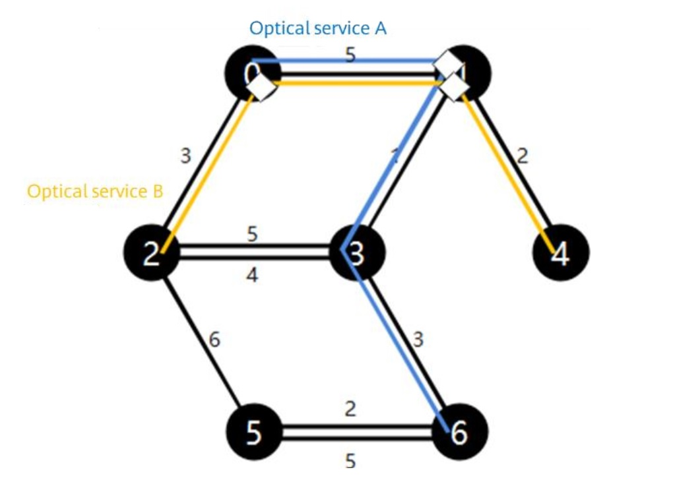

# Optical Network Expansion by Adding Fibers


### Windows:  type input.txt  | python solution.py


```
Time limit: 15 seconds for each test case
```
```
Space limit: 512 MB for each test case
```
**Context:**

```
An optical network can be simply considered as a connected undirected graph consisting of N nodes and
```
M edges with certain lengths. There may be multiple edges with different lengths between two adjacent nodes.


<p style="text-align: center;">Figure 1 Optical network with 7 nodes and 10 edges
(All figures in this contest are based on this example.).</p>


Each edge is split into P channels, which are distinguished by channel IDs 0 to (P − 1).


<p style="text-align: center;">Figure 2 Each edge split into P channels</p>


An optical network carries multiple optical services. Each optical service can be considered as a path that
traverses multiple edges from a start node to an end node. Each optical service occupies a channel on each

edge of the path, and the channel IDs for the same service must be the same on all edges. Multiple services

can use different channels on one edge, but cannot share the same channel on the same edge.


<p style="text-align: center;">Figure 3 : For optical service A, the path is 0 - >1->3->6 and the channel ID is 0.</p>


<p style="text-align: center;">Figure 4 Optical services A and B both pass through edge 0 − 1 and use different channels.</p>

```
The initial signal strength of each service is the same, and the signal strength attenuates as the distance
```
increases. When a service travels a distance that is greater than the maximum attenuation distance (D km)
(we assume that the length of any edge is shorter than or equal to D km), its signal strength is attenuated

to the extent that is insufficient for carrying a service. We can install signal amplifiers on the nodes to

empower signal strength. After an optical service pass through an amplifier, its signals are restored to the

initial strength. Each service can use multiple signal amplifiers, which is equivalent to splitting a path into

multiple sub-paths whose lengths are shorter than or equal to D km. One signal amplifier can amplify only

one service, and multiple amplifiers can be installed on each node to amplify multiple services.


<p style="text-align: center;">Figure 5 Given D = 6 , there are 2 solutions for adding amplifiers on the path of optical service A.</p>

```


<p style="text-align: center;">Figure 6: Given D = 6, service B uses 2 amplifiers. There are 2 amplifiers on node 1.</p>


**Task:**

Now, assume that there is an optical network, and all channels on all edges are idle. We need to add T
optical services on the optical network. Given the start node and end node of each service, we need to
select a channel ID and plan a feasible path for each service. If the path length is longer than D km, you
need to add some signal amplifiers to divide the path into multiple sub-paths.

If services cannot be added due to the exhaustion of certain necessary edge channels, you can add a
maximum of 20,000 edges so that all services can be successfully added. However, a new edge can be
added only between two adjacent nodes that already have an edge in the graph. The length of a newly
added edge is equal to the length of the shortest edge between two nodes, and all channels of the new
edge are initially idle.


**Scoring:**

A score will be awarded if the plan meets the above conditions. The score is evaluated based on the total
cost, the lower the total cost, the better.

1. For each edge that is added, the cost increases by 1,000,000.
2. For each added amplifier, the cost increases by 100.
3. For each edge, the cost increases by the number of services crossing this edge.

**Input:**

Line 1: There are 5 integers, which are N (number of nodes), M (number of edges), T (number of services),
P (number of channels on an edge), and D (maximum attenuation distance). (2 ≤ N, M ≤ 5000; 2 ≤ T ≤
10,000; 2 ≤ P ≤ 80; 2 ≤ D ≤ 1000)

Next M lines: The four integers ci, si, ti, and di in each line indicate that the ith edge has two nodes
numbered si and ti, and the length is di with edge ID ci. (Existing edges are numbered from 0 to M−1 i.e.
0 ≤ci≤M- 1 )

Next T lines: Each line contains two integers Sj and Tj, indicating the start node and end node of the jth
service to be added.

**Output:**

Line 1: integer Y, indicating the number of edges to be added.

Next Y lines: Each line has two integers si and ti, indicating the start node and end node of a new edge.
(New edges are numbered from M to M + Y − 1)

Next T lines: The first 3 integers pj, mj, and nj in each line indicate the channel ID, number of passed
edges, and number of passed amplifiers of service J. The next mj integers indicate the IDs of edges that
are sequentially passed through, and the next nj integers indicate the node IDs of amplifiers that are
sequentially passed through.

**Example:**

| Input |
| ------ | 
|7 10 6 4 6|
|0 0 1 5|
|1 0 2 3|
|2 1 3 1|
|3 1 4 2|
|4 2 3 5|
|5 2 3 4|
|6 2 5 6|
|7 3 6 3|
|8 5 6 2|
|9 5 6 5|
|0 6|
|2 4|
|2 4|
|2 4|
|2 4|
|2 4|

| Output |
| ------ | 
|1|
|1 4|
|0 3 1 0 2 7 1|
|1 3 1 5 2 3 1|
|2 3 1 5 2 3 1|
|3 3 1 5 2 3 1|
|1 3 2 1 0 10 0 1|
|2 3 2 1 0 10 0 1|


| Cost |
| ------ | 
|Number of added edges: 1|
|Number of amplifiers: 8|
|Total number of edges: 18|
|Total cost: 1,000,|


**Score**

1. Score = Average total cost of each test case
2. The smaller the score, the higher the ranking. When two scores are the same, the shorter the
    average running time, the higher the ranking.

**Error Code:**

If you received an invalid score, you will also receive an error code that indicates its cause.

**Basic error types:**

1. Code compilation error
2. Abnormal program exit (including but not limited to running errors, abnormal permissions, and
    excessive output data; You need to identify the cause for the error by yourself)
3. Exceeded the time limit
4. Exceeded the memory limit
5. Incorrect output format

**Logic error types:**

1. Exceeded the number limit for adding edge
2. Invalid node ID
3. Invalid edge ID
4. Invalid channel ID
5. Invalid number of edges on a path
6. Invalid number of amplifiers on a path
7. Invalid edges added
8. Discontinuous path
9. Amplifier not on path
10. Optical signals not amplified in time
11. Channel conflict
12. Invalid score (> 99,999,999,999)
13. Abnormal exit (contact contest technical experts for handling)
